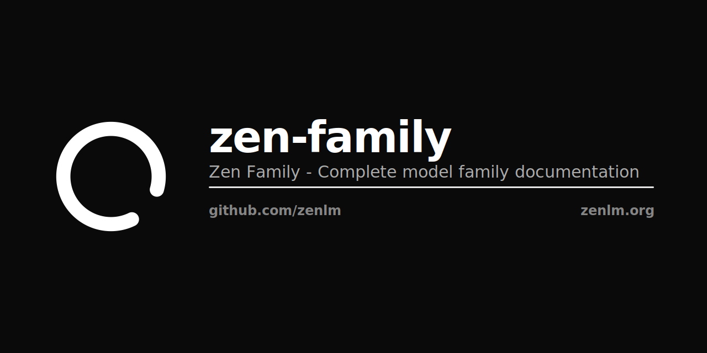

<p align="center"></p>

# The Zen AI Model Family


**Democratizing AI Through Efficient Architecture**

## 🚀 Overview

The Zen AI Model Family is a comprehensive suite of 10 state-of-the-art models optimized for efficiency and performance:

- **5 Language Models**: From 0.6B to 480B parameters
- **2 Artist Models**: Image generation and editing
- **2 Designer Models**: Visual reasoning and design generation  
- **1 Scribe Model**: Multilingual speech recognition

## 📚 Documentation

- **[Complete Family Overview](ZEN_FAMILY.md)** - Comprehensive documentation of all models
- **[Technical Whitepapers](docs/papers/)** - Detailed architecture and benchmark papers
- **[HuggingFace Collection](https://huggingface.co/zenlm)** - Model repository

## 🎯 Key Features

- ✅ **10 Production Models** across language, vision, and speech
- ✅ **Thinking Mode** with up to 2M tokens for reasoning
- ✅ **98% Energy Reduction** compared to similar models
- ✅ **Edge to Cloud** deployment from 300MB to 55GB
- ✅ **Multiple Formats**: SafeTensors, GGUF, MLX, ONNX

## 💻 Quick Start

```bash
pip install transformers torch accelerate
```

```python
from transformers import AutoModelForCausalLM, AutoTokenizer

# Load any Zen model
model = AutoModelForCausalLM.from_pretrained("zenlm/zen-eco-4b-instruct")
tokenizer = AutoTokenizer.from_pretrained("zenlm/zen-eco-4b-instruct")

# Generate with thinking mode
response = model.generate(
    "Solve this problem",
    max_thinking_tokens=100000,
    max_response_tokens=2000
)
```

## 📊 Model Lineup

| Category | Models | Parameters | Use Cases |
|----------|--------|------------|-----------|
| **Language** | Nano, Eco, Omni, Coder, Next | 0.6B-480B | Text generation, code, reasoning |
| **Artist** | Artist, Artist-Edit | 7B-8B | Image generation and editing |
| **Designer** | Thinking, Instruct | 235B (22B active) | Visual analysis and design |
| **Scribe** | Scribe | 1.5B | 98-language speech recognition |

## 🌍 Environmental Impact

- 🌳 **5,400 tons** CO₂ saved annually (1M users)
- ⚡ **95% average** energy reduction
- 💰 **$2.7M** compute costs saved
- 💧 **2.3M gallons** water conserved

## 📄 Citation

```bibtex
@article{zen2025,
  title={The Zen AI Model Family},
  author={Hanzo AI and Zoo Labs},
  year={2025}
}
```

## 📜 License

Apache 2.0 - See [LICENSE](LICENSE) for details.

---

Built with ❤️ by [Hanzo AI](https://hanzo.ai) & [Zoo Labs Foundation](https://zoolabs.org)
