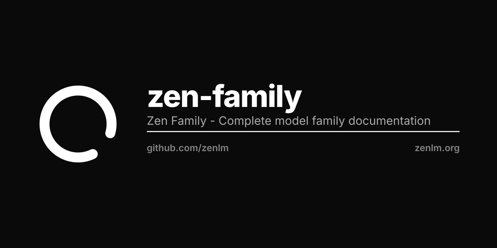

<p align="center"></p>

# The Zen AI Model Family


Zen fine-tunes the best open-weight model of each era. Across this family that is the **Qwen3** line from Alibaba Cloud — base, VL, Omni, Embedding, Reranker, TTS, ASR, Guard, Coder — with media models on permissive bases (Wan, FLUX, TRELLIS, YuE). Hanzo adds only identity training, agentic-data fine-tuning, and abliteration. There is no from-scratch Zen model.

## Base models & attribution

- **Language / VL / Omni / Coder / Guard / Embedding / Reranker / TTS / ASR:** fine-tuned from [Qwen3](https://github.com/QwenLM/Qwen3) (Alibaba Cloud, Apache-2.0). The reference language checkpoint fine-tunes [Qwen/Qwen3-8B](https://huggingface.co/Qwen/Qwen3-8B).
- **Media (image / video / 3D / audio):** permissive bases — FLUX.1-schnell (Apache-2.0), Wan2.2, TRELLIS (MIT), YuE.

Each model card on [huggingface.co/zenlm](https://huggingface.co/zenlm) lists its exact `base_model` and license.

## Documentation

- [Docs](docs/)
- [HuggingFace Collection](https://huggingface.co/zenlm)

## Quick start

```bash
pip install transformers torch accelerate
```

```python
from transformers import AutoModelForCausalLM, AutoTokenizer

model = AutoModelForCausalLM.from_pretrained("zenlm/zen-eco-4b-instruct")
tokenizer = AutoTokenizer.from_pretrained("zenlm/zen-eco-4b-instruct")
```

## Citation

```bibtex
@article{zen2025,
  title  = {The Zen AI Model Family},
  author = {Hanzo AI and Zoo Labs},
  year   = {2025}
}
```

## License

Apache-2.0 — see [LICENSE](LICENSE) and [NOTICE](NOTICE). Upstream Qwen3 is Apache-2.0.

---

Built by [Hanzo AI](https://hanzo.ai) and [Zoo Labs Foundation](https://zoolabs.org)
